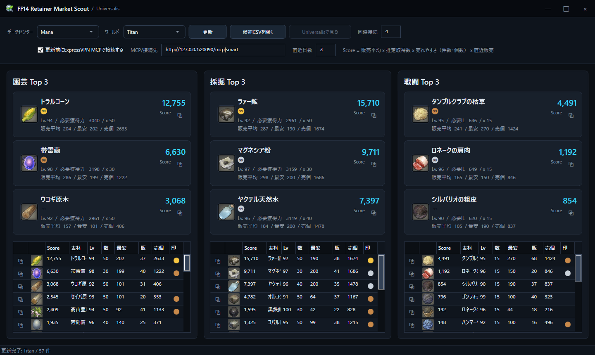

# FF14 Retainer Market Scout

FF14のリテイナーに「今、何を取ってきてもらうとよさそうか」を調べるためのWindowsアプリです。

園芸・採掘・戦闘リテイナーが取ってこられる素材を、Universalisの販売実績をもとに並べます。  
高く出品されているだけの素材ではなく、「最近、実際に売れているか」を重視します。

## スクリーンショット



## このアプリでできること

- 園芸、採掘、戦闘リテイナー別におすすめ素材を確認
- 各リテイナーの上位3件をカードで表示
- 直近3日など、最近の売れ行きだけに絞ってランキング
- 99個まとめ売りされやすい素材を色付きバッジで表示
- アイテム名をコピー
- 気になる素材をUniversalisで開く

## 起動方法

最新版はGitHub Releasesからダウンロードできます。

[最新版をダウンロード](https://github.com/Aoshiso-Dev/RetainerMarketScout/releases/latest)

zipファイルを展開して、次のファイルを起動してください。

```text
RetainerMarketScout.exe
```

同じフォルダにある `retainer_items.csv` は、リテイナーが取ってこられる素材リストです。削除しないでください。

## 最初にやること

1. データセンターを選びます。例: `Mana`
2. ワールドを選びます。例: `Titan`
3. ExpressVPNを使っていない場合は、「更新前にExpressVPN MCPで接続する」のチェックをオフにします。
4. 直近日数を確認します。初期値は `3` 日です。迷ったらそのままで大丈夫です。
5. 「更新」を押します。

更新中はボタンが「中止」に変わります。途中で止めたいときは「中止」を押してください。

## 画面の見方

画面は3つの列に分かれています。

- 園芸 Top 3
- 採掘 Top 3
- 戦闘 Top 3

各列の上にある大きなカードが、そのリテイナーで特におすすめの素材です。  
下のリストには、候補素材がScoreの高い順に並びます。

## Scoreとは

Scoreは「今リテイナーに取りに行かせる価値がありそうか」を表す目安です。

Scoreが高くなりやすい素材:

- 直近X日間で実際に売れている
- 売れた単価が高い
- 売れた回数が多い
- 売れた個数が多い
- 最近売れている
- リテイナーが1回で多く取ってこられる
- 99個まとめ売りされやすい

Scoreに使うのは販売実績です。  
現在出品中の最安価格は、Scoreには使っていません。

つまり、高く出品されているだけで売れていない素材は上がりにくくなっています。

## リストの項目

| 項目 | 意味 |
| --- | --- |
| Score | おすすめ度です。高いほど上に来ます。 |
| 素材 | アイテム名です。 |
| Lv | リテイナーベンチャーのレベルです。 |
| 数 | リテイナーが1回で取ってくる推定個数です。 |
| 最安 | 現在マーケットに出ている最安値です。参考表示で、Scoreには使っていません。 |
| 販 | 直近X日間に売れた回数です。 |
| 売個 | 直近X日間に売れた合計個数です。 |
| 印 | 99個まとめ売りされやすい素材に色付きの丸印が出ます。 |

## 99個売りの印

素材によっては、1個ずつではなく99個まとめて買われるものがあります。  
そういう素材は、クラフターがまとめ買いしている可能性があります。

印の色は、直近X日間の販売件数のうち、99個売りがどれくらいあったかを表します。

| 色 | 意味 |
| --- | --- |
| 金色 | 99個売りが30%以上 |
| 銀色 | 99個売りが20%以上 |
| 銅色 | 99個売りが10%以上 |

印がある素材は、まとめ売り需要がありそうな素材です。  
ただし、必ず99個で売れるという意味ではありません。

## 直近日数

直近日数は、「何日分の売れ行きを見るか」です。

初期値は `3` 日です。最近の流行や需要を見たいなら、3日のままがおすすめです。  
もう少し安定した傾向を見たい場合は、7日などに広げてください。

- 短くすると、今まさに売れている素材が見つかりやすくなります。
- 長くすると、一時的な売れ方に左右されにくくなります。

## ExpressVPNについて

このアプリには、更新前にExpressVPN MCPへ接続するオプションがあります。

ExpressVPNを使っていない人は、「更新前にExpressVPN MCPで接続する」のチェックをオフにしてください。  
チェックがオンのままだと、ExpressVPN MCPに接続できない環境では更新に失敗します。

ExpressVPNを使う場合は、次の点を確認してください。

- ExpressVPNのベータ版デスクトップアプリを使っている
- ExpressVPN側でMCPサーバー機能が有効になっている
- MCP/接続先が次のような形式になっている

```text
http://127.0.0.1:20090/mcp|smart
```

`smart` はExpressVPN側のおまかせ接続です。

## 便利な使い方

アイテム名をコピー:

カードやリストのコピーボタンを押すと、アイテム名をコピーできます。ゲーム内マーケットボードで検索するときに便利です。

Universalisで見る:

リストで素材を選んで「Universalisで見る」を押すと、その素材のページを開けます。出品数や価格の動きを詳しく見たいときに使ってください。

## うまく動かないとき

更新でエラーになる:

ExpressVPNを使っていない場合は、ExpressVPNのチェックをオフにしてください。データセンターとワールドが選ばれているか確認してください。少し時間を置いてからもう一度更新してみてください。

Scoreが0ばかりになる:

直近日数内に売れていない可能性があります。直近日数を7日などに広げてみてください。

画像が出ない:

アイテム画像の取得に失敗している可能性があります。ランキング自体には大きな影響はありません。

コピーできない:

もう一度押してみてください。成功すると画面下に「コピーしました」と表示されます。

## 注意

このアプリは、Universalisに集まっているマーケット情報をもとにしています。

Universalisの情報はプレイヤー投稿ベースなので、ゲーム内マーケットと少しズレることがあります。

最終的に出品する前には、ゲーム内マーケットボードやUniversalisのページも確認するのがおすすめです。
